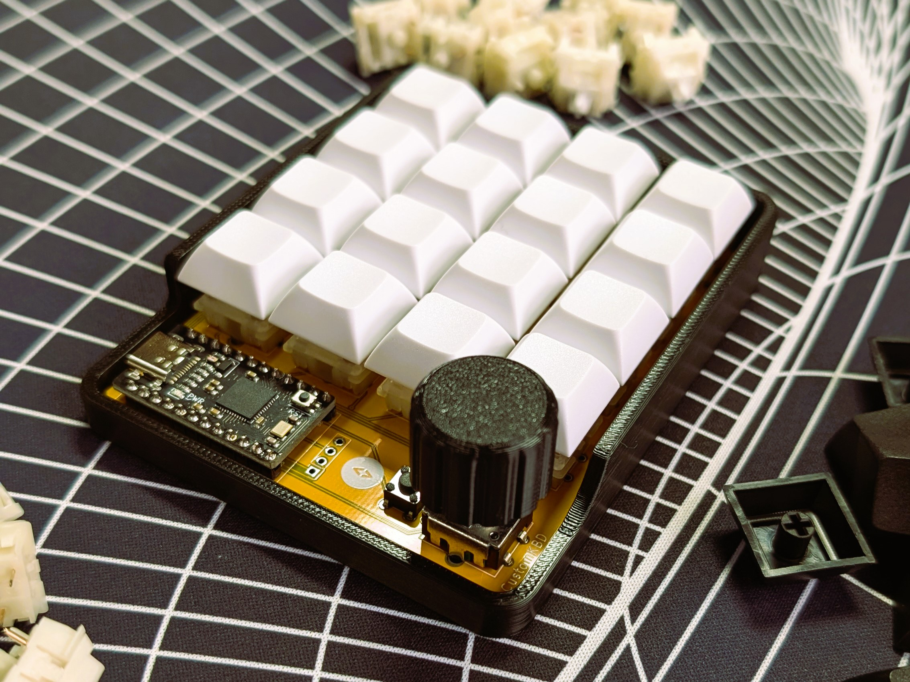

<!DOCTYPE html>
<html lang="en">
<head>
    <meta charset="UTF-8">
    <meta name="viewport" content="width=device-width, initial-scale=1.0">
</head>
<body>

<h1>Macropad - MAC x SMEE</h1>

This project involves building a 4x4 switch macropad with a rotary encoder and a single button. It was developed for the Monash Association of Coding (MAC) Macropad Workshop.

    
    

<h2>Hardware</h2>

<h3>Components Used:</h3>
<ul>
    <li><strong>Microcontroller:</strong> Pro Micro Atmega32U4 5V</li>
    <li><strong>Rotary Encoder:</strong> EC11 Rotary Encoder</li>
    <li><strong>Macropad Kit:</strong> Dumpad-V2 Kit
        <ul>
            <li>Macropad PCB</li>
            <li>IN4148 Diode x 17</li>
            <li>6x6x4.5mm PCB Push Button Switch 4 Pin DIP</li>
        </ul>
    </li>
    <li><strong>Switches:</strong> 5-Pin Switches x 16</li>
    <li><strong>Keycaps:</strong> 16 keycaps</li>
    <li><strong>Enclosure:</strong> 3D Printed Case and Rotary Cap</li>
</ul>

<h2></h2>

<h3>Suppliers:</h3>
<table>
    <tr>
        <th>Component</th>
        <th>Supplier</th>
        <th>Store URL</th>
    </tr>
    <tr>
        <td><strong>Macropad Kit & Components</strong></td>
        <td>customKBD</td>
        <td><a href="https://customkbd.com/">https://customkbd.com/</a></td>
    </tr>
    <tr>
        <td><strong>Switches and Keycaps</strong></td>
        <td>Idyllic</td>
        <td><a href="https://mechstock.com.au/">https://mechstock.com.au/</a></td>
    </tr>
    <tr>
        <td></td>
        <td>CAFEGE</td>
        <td><a href="https://cafege.com.au/">https://cafege.com.au/</a></td>
    </tr>
</table>

<h2></h2>

<h1>Build Guide</h1>

<h2>1. Solder the Diodes</h2>

<h3>Insert the Diodes</h3>
<ul>
    <li>Feed the diodes through their designated holes on the PCB.</li>
    <li>Ensure that the diodes are oriented correctly; the PCB shows the direction with a line that should match up with the line on the diode.</li>
</ul>

    
    

<h3>Bend and Solder the Legs</h3>
<ul>
    <li>Flip the board over and bend the diode legs to hold them in place.</li>
    <li>Solder all 17 diode legs from the same side.</li>
</ul>

<ul>
    <li>Carefully trim down the legs.</li>
    <li><strong>Warning:</strong> Hold the leg with one hand while snipping to prevent it from flying.</li>
</ul>

<h2>2. Install the Microcontroller</h2>

<h3>Prepare the Microcontroller</h3>
<ul>
    <li>With the PCB face up and the MAC logo visible, insert the long legs of the microcontroller pins through the dedicated holes.</li>
</ul>

<h3>Solder the Microcontroller</h3>
<ul>
    <li>Place the microcontroller on top of the pins to hold them in place.</li>
    <li>Flip the board over while holding the pins and microcontroller in place.</li>
    <li>Solder all four corners first, then continue by soldering the remaining pins.</li>
</ul>

  
  

<ul>
    <li>Trim down the legs.</li>
    <li><strong>Warning:</strong> These legs are thicker and may fly when cut, so cover them with your hand or use a book or paper to shield yourself.</li>
</ul>

    
    

<h3>Final Soldering</h3>
<ul>
    <li>Turn the board back over and solder the remaining pins.</li>
</ul>

<h2>3. Attach the Push Button</h2>

<h3>Insert the Button</h3>
<ul>
    <li>Place the push button into the dedicated holes on the PCB.</li>
    <li>The button should slide in easily, and its orientation should match the image provided.</li>
</ul>

<h3>Solder the Button</h3>
<ul>
    <li>Flip the board over and solder the button's pins.</li>
</ul>

<strong>Created by:</strong> Ethan Dmello

  
  Monash Association of Coding (MAC)

<h3>Connect with Us</h3>

  
  
  
  

</body>
</html>
